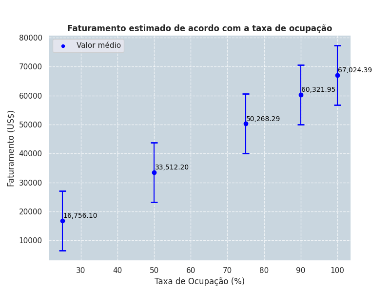

# Case de Precificação de Imóvel em Nova York

___
## **Arquivos:**  
→ Dados usados para análise: [data](https://github.com/apfreirea/case-precificacao-imovel/tree/main/data)  
→ Modelo desenvolvido XGBoost: [model](https://github.com/apfreirea/case-precificacao-imovel/tree/main/model)  
→ Acesso ao notebook com o case completo: [case-precificacao.ipynb](https://github.com/apfreirea/case-precificacao-imovel/blob/main/case-precificacao.ipynb)   
___
## **Objetivo:**
Este projeto teve como objetivo precificar um imóvel disponível para aluguel na cidade de Nova York, utilizando análise exploratória de dados, estatísticas descritivas e modelos de machine learning.
Além da precificação, algumas perguntas foram respondidas: 
 
🔹Qual o melhor bairro para investir?  
🔹O número mínimo de noites e a disponibilidade afetam o preço?  
🔹Existem padrões nos anúncios de imóveis mais caros?  
___
## **Etapas:**
### **1. Análise exploratória dos dados (EDA)**

**Tratamento de dados:** remoção de valores nulos, duplicatas e outliers. 
**Análise estatística:** identificação de padrões, correlações de Pearson e Spearman (lineares e não lineares) e tendências. 
**Engenharia de variáveis:** criação de novas métricas para melhor entendimento do faturamento. 

### **2. Modelo de precificação**

Foram testados três modelos de machine learning: 
**Regressão Linear** → Simples, mas com baixa capacidade de captura de padrões complexos. 
**Random Forest** → Melhorou os resultados, mas ainda apresentava alto erro médio. 
**Random Forest 2** → Remoção de outliers para melhora de resultados. 
**XGBoost** → Melhor desempenho entre os modelos testados. 

        Previsão do modelo:
        📌 Melhor modelo: XGBoost 
        📌 Preço previsto para o imóvel: US$ 188,81 
        📌 Erro médio do modelo (MAE): ± US$ 28,95 
        📌 Faixa de preço estimada: US$ 159,86 - US$ 217,76

### **3. Estimativa de faturamento**

Estimativa de faturamento anual de acordo com as possíveis taxas de ocupação do imóvel.

### **4. Resumo final**

O projeto demonstrou que o **XGBoost é o modelo mais eficiente** para precificação de imóveis, prevendo **um preço médio de US$ 188,81**, com um erro de aproximadamente US$ 29 para mais ou para menos.

**Manhattan continua sendo a melhor região para investimento**, e estratégias como descrições estratégicas e diferenciação por comodidades podem otimizar os ganhos do cliente. Mínimo de noites e disponibilidade não impactam o preço final. 

Agora, o cliente pode tomar decisões baseadas em dados para otimizar sua precificação e maximizar sua receita no mercado de aluguel de Nova York!

